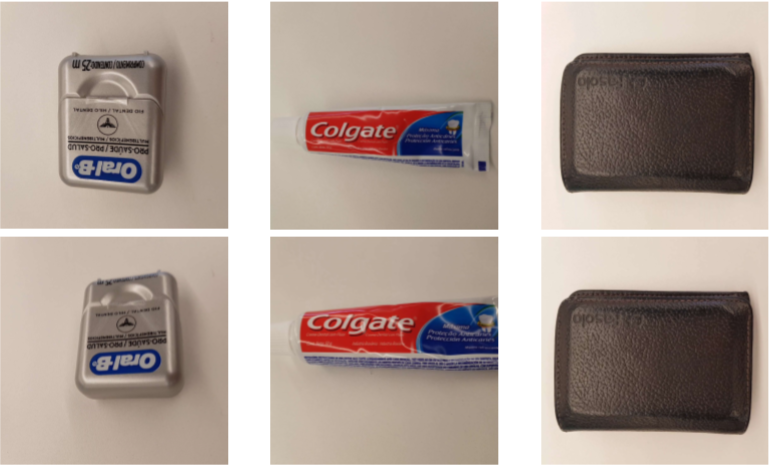
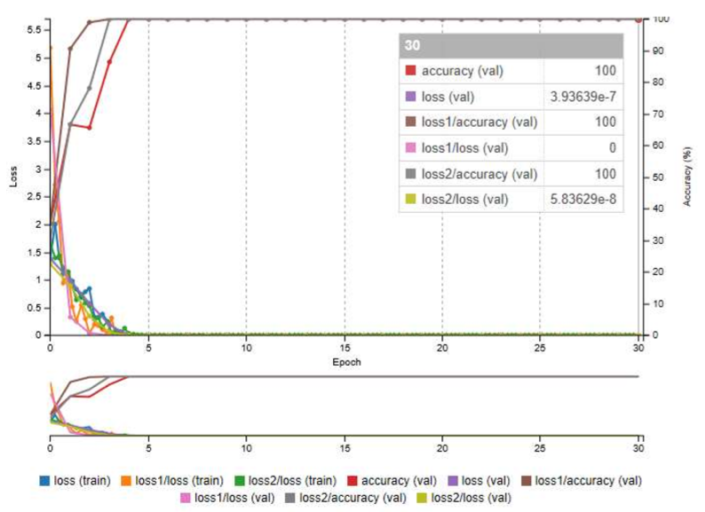
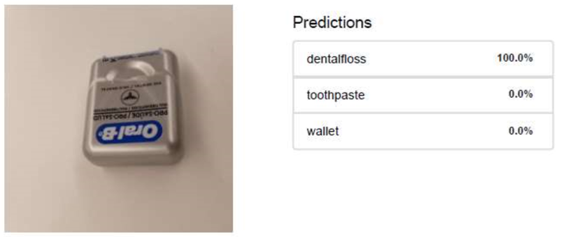
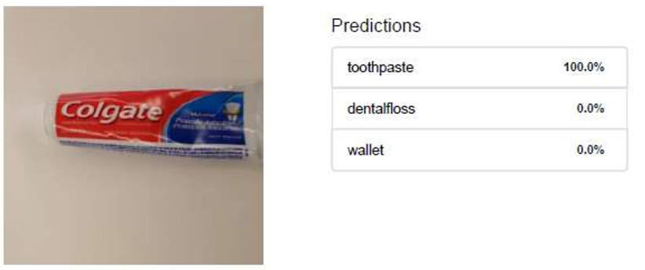
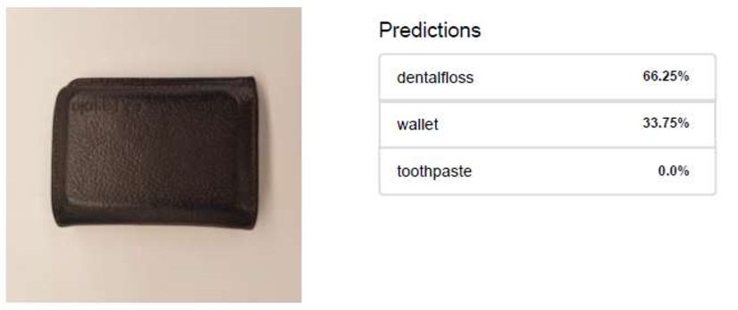
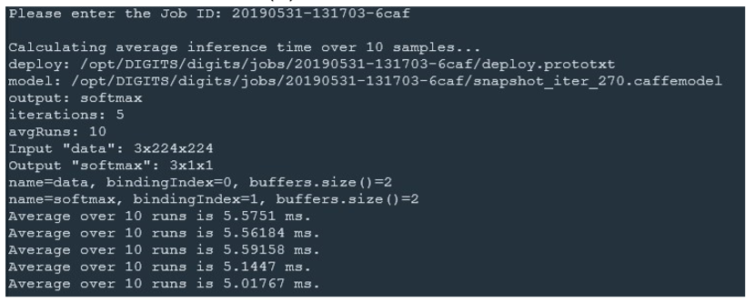

# RoboND Robotic Inference Project

Robotic Inference using NVidia DIGITS and NVidia Jetson TX2 Development Board

# Classifying Objects Using Neural Network
### &copy; Francisco E. Ortiz 
### Junho/2019

## Abstract

This project aims to use a neural network to classify three classes of objects, the data were collected through a mobile camera. Udacity's NVIDIA DIGITS workspace was used for training using the GloogleNet model. The accuracy and time of the network inference were analyzed in order to meet the project requirement.

## Introduction

In robotics one of the major challenges is the recognition of objects by video stream in real-time cameras, because speed and precision become important for fast and safe action. Thus, the accuracy and response in embedded systems, such as IoT devices, are factors that determine adherence and fewer frustrations by the end user. For this purpose to be possible, the use of deep neural network in GPU makes it efficient and feasible.  The training and development of a deep neural network requires time, but to accelerate this process, NVIDIA provides an application called DIGITS, providing a simple interface for training and performance testing of inferences with Graphics presentation.  For the embedded system used in this project, we will assume the NVIDIA Jetson TX1/TX2. 

## Background / Formulation

The NVIDIA DIGITS application has three standard models for image sorting ((LeNet, AlexNet and GoogleNet).   After several experiments performed both in AlexNet and GoogleNet, the results showed that the time of inference is quick for the challenge and was adopted to GoogleNet for presentation in this work, because it shows efficiency for the trained data.   The parameters used were the default of the tool, being 30 epoch, 0.01 for the learning rate, 25% for evaluation.

## Data Acquisition
### Collected Dataset

The data provided consist of standard. mp4 movies filmed from a camera of a Samsung S8 smartphone with motion to change poses and extracted as motion for changing poses and extracted as standard 24-bit RGB frames. JPG, size of 1440x1440, categorized into three groups: Dentalfloss (120 images), toothpaste (120 images) and wallet (120 images). Examples of images are shown in Fig. 1.0.  The images were uploaded to the workspace NVIDIA DIGITS, and from this set of images were used 75% for training and 25% of it used as a set of tests. In the process of creating the dataset the images were reduced by the tool the size of 256x256 RGB 8 bits and used resize transformation Squash. 

  

 Fig. 1: Collected Dataset Images.  

## Results
### Results-Using Supplied Data

The result of the training tested on NVIDIA DIGITS presented an accuracy of 100%, as shown in Fig. 2a. 

  

 (a) Loss and Accuracy Curves  

  

 (b) Inferência DentalFloss 

  

 (c) Inferência ToothPaste 

  

 (d) Inferência Wallet  

  

 (e) Command Evaluate   

 Fig. 2: Resultados de Treinamento e Predição.   

During data tests the inference obtained correct classification for Dentalfloss data (Fig. 2b), toothpaste (Fig. 2c) and a lower percentage for the wallet (Fig. 2d).   The "Evaluation" command provided by Udacity was used for network testing, but presented problem in the result of accuracy. The maximum inference time was 5.6ms and the accuracy error occurred, the defined requirements are up to 10ms of response and 75% accuracy, and the last one could not be generated, presented in Fig. 2e

## Discussion
### Collected Dataset 

The network presents a satisfactory result both in training and in the test suite. It is capable of classifying objects with an accuracy of 75% despite presenting a training with 100% accuracy. We can observe that even the result having been good for 2 objects The result was not good for the toothpaste, and the ideal for the result is the recognition of all objects. This may have occurred due to the low amount of images and larger variations in size, angles, illumination, and background scenarios. 

## Conclusion / Future work

The neural network model was constructed from the data collected to classify the objects exposed in the scene. The accuracy was satisfactory, but its performance was not suitable for the recognition of the wallet. Future works may include more varied images and in greater quantity for performance to reach a margin for use on real devices, as well as implementation in NVIDIA Jetsion TX2. 

